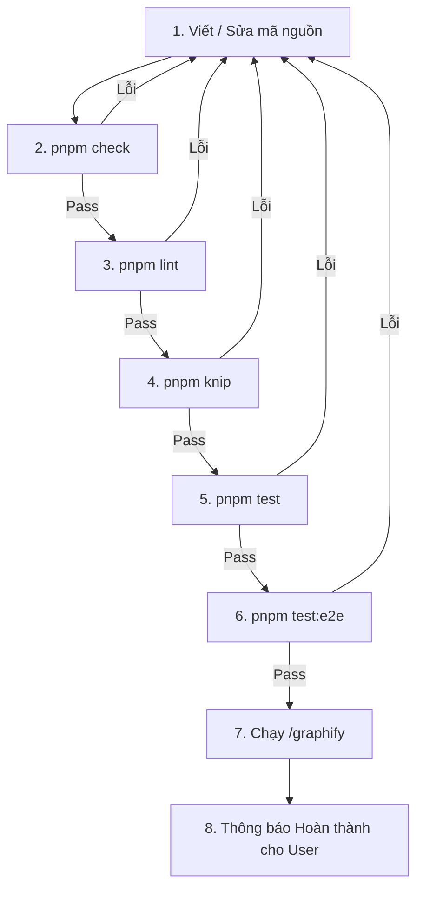

# 📋 QUY TRÌNH PHÁT TRIỂN & CHỈNH SỬA CODE (DEVELOPMENT WORKFLOW)

> **Tài liệu quy chuẩn bắt buộc** dành cho tất cả nhà phát triển (Developers) và AI Coding Agents khi tham gia chỉnh sửa, thêm tính năng hoặc tái cấu trúc mã nguồn dự án **Ebook Tools**.

---

## 🔒 1. Quy tắc Quản lý Gói (Package Manager Rule)

* **CHỈ ĐƯỢC DÙNG `pnpm`** (Tuyệt đối không dùng `npm` hoặc `yarn`).
* Luôn tuân thủ lockfile `pnpm-lock.yaml`.

```bash
# Cài đặt package mới
pnpm add <package-name>

# Cài đặt dev dependency
pnpm add -D <package-name>
```

---

## 🔄 2. Chu trình Chỉnh Sửa Code Chuẩn (Edit-Check-Test-Graphify Flow)

Mỗi khi thực hiện bất kỳ thay đổi nào trong mã nguồn, bạn **PHẢI** thực hiện tuần tự theo quy trình sau:



---

### Chi tiết các bước thực hiện:

### 🔹 Bước 1: Viết / Sửa code
* Thực hiện chỉnh sửa mã nguồn hoặc bổ sung tính năng mới.
* Tuân thủ kiến trúc mô-đun hóa và Svelte 5 Rune (`$state`, `$derived`, `$props`).

---

### 🔹 Bước 2: Kiểm tra kiểu dữ liệu (Type Check)
```bash
pnpm check
```
* **Mục tiêu**: Đảm bảo toàn bộ TypeScript và Svelte template đạt **0 errors, 0 warnings**.
* *Nếu có lỗi*: Sửa ngay lập tức trước khi chạy các bước tiếp theo.

---

### 🔹 Bước 3: Kiểm tra định dạng & cú pháp (Linting)
```bash
pnpm lint
```
* **Mục tiêu**: Đảm bảo tuân thủ tiêu chuẩn mã nguồn của ESLint.

---

### 🔹 Bước 4: Quét mã rác & exports thừa (Dead Code Analysis)
```bash
pnpm knip
```
* **Mục tiêu**: Phát hiện các file thừa, hàm không dùng hoặc dependencies chưa sử dụng.

---

### 🔹 Bước 5: Chạy Bộ Kiểm Thử Tự Động (Unit & Integration Tests)
```bash
pnpm test
```
* **Mục tiêu**: Chạy toàn bộ 213+ unit tests và kịch bản thực tế (pack TXT, pack ZIP markdown, rebuild TOC, optimize).
* **Yêu cầu**: **100% tests phải PASS**. Nếu có test fail, tìm nguyên nhân và sửa code/test ngay.

---

### 🔹 Bước 6: Chạy Kiểm thử Giao diện Trình duyệt Thật (Playwright E2E)
```bash
pnpm test:e2e
```
* **Mục tiêu**: Mở trình duyệt Chromium giả lập thao tác người dùng (kéo thả file, mở modal, click nút bấm, kiểm tra Live Preview).

---

### 🔹 Bước 7: Cập nhật Đồ thị Tri thức Dự án (Update Graphify)
Sau khi toàn bộ kiểm thử và kiểm tra chất lượng đã PASS:
* Chạy lệnh `/graphify` để cập nhật `graphify-out/GRAPH_REPORT.md` và `graph.json`, đảm bảo kiến trúc dự án luôn được đồng bộ.

---

### 🔹 Bước 8: Báo cáo kết quả cho Người Dùng (User Notification)
* Trình bày tóm tắt rõ ràng các file đã sửa/tạo mới.
* Báo cáo kết quả vượt qua của toàn bộ Quality Gates (`pnpm check`, `pnpm test`, `pnpm test:e2e`).

---

## ⚡ Bảng tra cứu Lệnh Nhanh (Cheat Sheet)

| Lệnh | Ý nghĩa | Khi nào dùng |
| :--- | :--- | :--- |
| `pnpm dev` | Khởi chạy máy chủ phát triển (localhost:5173) | Khi lập trình giao diện |
| `pnpm check` | Kiểm tra lỗi TypeScript & Svelte Rune | Sau khi sửa code |
| `pnpm lint` | Kiểm tra lỗi ESLint | Trước khi commit |
| `pnpm knip` | Quét file/export rác | Trước khi commit |
| `pnpm test` | Chạy 213+ Unit & Integration Tests | Thường xuyên trong khi code |
| `pnpm test:watch` | Chế độ tự động test lại khi lưu file | Khi viết tính năng mới |
| `pnpm test:e2e` | Chạy trình duyệt Playwright E2E | Trước khi release/deploy |
| `pnpm build` | Đóng gói bản Production | Trước khi deploy |
